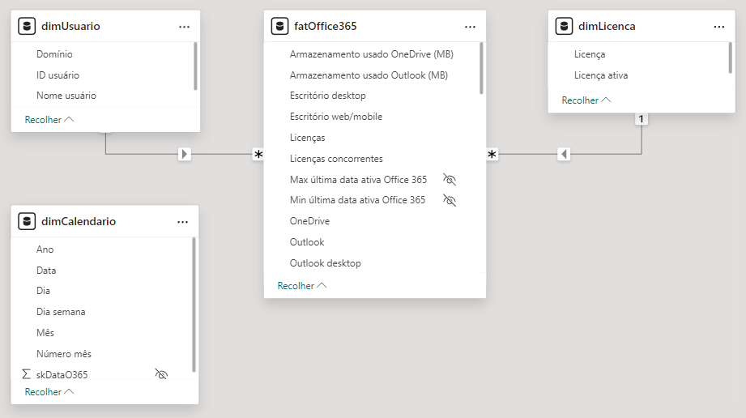
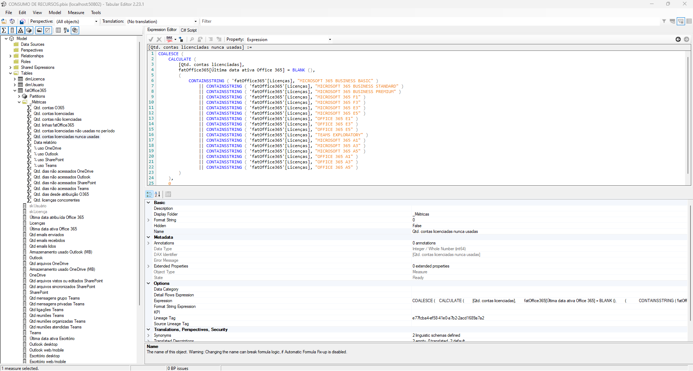

# Office 365 Resource Consumption

Resource consumption report made for Lanlink Informática client and developed with Power BI to identify the consumption of resources offered for the client's Microsoft licenses.
  
This report is used to track the usage of features offered by Microsoft licenses in order to diagnose the need to reassign the user's license to another or simply change licenses to reduce organizational costs.
  
The report's interactive features are based on the use of buttons that allow users to navigate between pages in a way similar to browsing the internet, and to switch between views using bookmarks.
  
The business problems that the report helps to solve are:

- Lack of tracking of the usage of each tool's capabilities that each license provides.
- Users may have more than one license and these may have common features.
- Difficulty exporting data from their system and manipulating informations in spreadsheets.
- Segmentation of information by license, tenant domain, and user ID.

**Client data was anonymized in compliance with the Brazilian LGPD standard.**

## Modelo e fonte de dados 

After speaking with the business team, we were informed about the data sources. Initially, it was expected to be a direct extraction via API, but due to the data engineering team not providing a timeline for the completion of their activities (authentication setup, defining data storage in their repository, monitoring, etc.) and the client's urgency to create the report, the data sources used ended up being CSV files extracted from the Microsoft administration center.
  
Having identified the client's needs, business rules, and their application in the data model, we began development. The simplistic appearance of the data model is intentional to facilitate maintenance work by other professionals.
    

## Metrics

To organize the measures, we created a folder within the corresponding tables, always following the standardization of names.
  
Main metrics:
- Total O365 accounts.
- Total licensed accounts.
- Total unlicensed accounts.
- Total Office 365 lines.
- Total licensed accounts not used during the period (max 180 days).
- Total licensed accounts never used.
- Report date.
- OneDrive usage percentage.
- Outlook usage percentage.
- SharePoint usage percentage.
- Teams usage percentage.
- Number of days since last access to OneDrive.
- Number of days since last access to Outlook.
- Number of days since last access to SharePoint.
- Number of days since last access to Teams.
- Number of days since 0365 assignment.
- Total concurrent licenses.

## Tools

